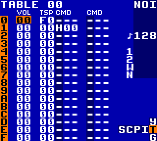

.. _basic-instruments:

Basic Instruments
=================

A collection of simple, reusable instruments.

Pulse 1 Bass Drum
-----------------
.. raw:: html

	<audio controls>
		<source src="../_static/basic-instruments/pulse-1-bass-drum.ogg">
	</audio>

C major scale.

Play the instrument at note ``C-6``.

For a snappier kick, experiment with ADSR.

Noise Snare Drum
----------------
.. raw:: html

	<audio controls>
		<source src="../_static/basic-instruments/noise-snare-drum.ogg">
	</audio>

Shapes from ``E8`` to ``EF``.

Noise Hi-Hats
-------------
.. raw:: html

	<audio controls>
		<source src="../_static/basic-instruments/noise-closed-hi-hat.ogg">
	</audio>

	<audio controls>
		<source src="../_static/basic-instruments/noise-open-hi-hat.ogg">
	</audio>

``FF`` notes of closed and open hi-hats, respectively.

Noise Cymbal
------------
.. raw:: html

	<audio controls>
		<source src="../_static/basic-instruments/noise-cymbal.ogg">
	</audio>

``EE`` notes.

Wave Bass Drum
--------------
.. raw:: html

	<audio controls>
		<source src="../_static/basic-instruments/wave-bass-drum.ogg">
	</audio>

C major scale (no significant difference in sound between notes).

Play the instrument at note ``C-5``, ``C-6``, or above.
