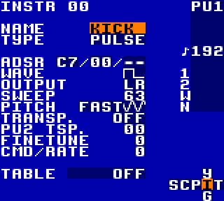

.. _instruments:

Instruments
===========

A collection of reusable instruments.

Pulse 1 Bass Drum
-----------------
.. raw:: html

	<audio controls>
		<source src="../_static/instruments/pulse-1-bass-drum.ogg">
	</audio>

|

Play the instrument at note ``C-6``.

For a snappier kick, experiment with ADSR.